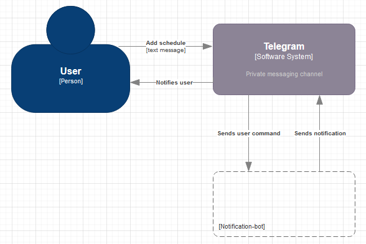

# notification-bot

Open source implementation of server that sends notifications based on some schedule. Schedule is configurable per user.
Currently, we are considering Telegram bot api as a main destination of generated notifications. But API is flexible
enough to add another destinations.

## Schedule:

To add schedule you need send text message (**command**) to bot.

### Command structure:

`<command>` `<trigger time>` `<triger date>` `<notification text>`.  
Where:

`<command>` - command name.

- /add - adds new schedule

`<trigger time>` - time when bot will send notification.  
`<triger date>` - day when user wants to get notification. Optional value. If not present, bot will send notification
only once (during the same day when user added notification). Possible values: 

- every day
- every - can be added to week days
- Monday, Tuesday, Wednesday, Thursday, Friday, Saturday, Sunday

`<notification text>` - text that will be printed by bot in notification message.

### Command examples

- `/add 11:15 check email`
- `/add 16:30 every day call boss`
- `/add 10:00 every Monday`

We do not support multi-language support at this stage.

## Structural diagrams

